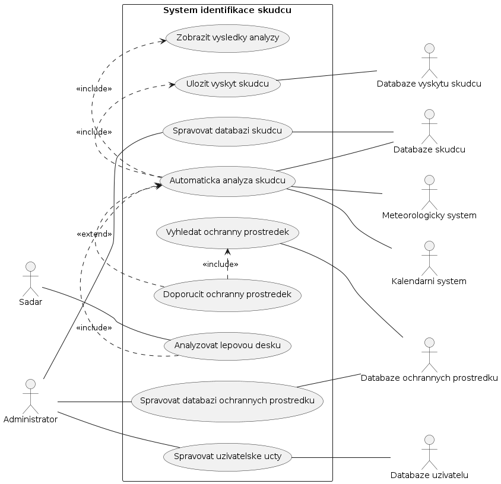

Zadání UC diagramu

Systém automatické identifikace škůdců ovocných stromů

Systém automatické identifikace škůdců ovocných stromů umožňuje sadaři nahrát fotografii lepové desky a zadat umístění desky v rámci sadu (pole nebo sektor). Na základě dodané fotografie systém automaticky provede analýzu obrazu, identifikuje jednotlivé druhy škůdců a určí jejich počet. Při vyhodnocení zohledňuje také aktuální a historická hydrometeorologická data a kalendářní informace, které získává z externích systémů. Výsledky analýzy zobrazí uživateli a současně je uloží do databáze jako evidenci výskytu škůdců s údajem o datu a lokalitě zjištění. Systém dále vyhodnocuje míru napadení a v případě potřeby vyhledá v databázi ochranných prostředků vhodný postřik, který sadaři doporučí včetně základních informací o přípravku. Administrátor systému spravuje databázi škůdců, databázi ochranných prostředků a uživatelské účty.



Zdrojový kód

```bash
@startuml
left to right direction
actor Sadar
actor Administrator
actor "Meteorologicky system" as Meteo
actor "Kalendarni system" as Calendar
actor "Databaze skudcu" as PestDB
actor "Databaze ochrannych prostredku" as SprayDB
actor "Databaze vyskytu skudcu" as OccDB
actor "Databaze uzivatelu" as UserDB
rectangle "System identifikace skudcu" {
usecase "Analyzovat lepovou desku" as UC1
usecase "Automaticka analyza skudcu" as UC2
usecase "Zobrazit vysledky analyzy" as UC3
usecase "Ulozit vyskyt skudcu" as UC4
usecase "Doporucit ochranny prostredek" as UC5
usecase "Vyhledat ochranny prostredek" as UC6
usecase "Spravovat databazi skudcu" as UC7
usecase "Spravovat databazi ochrannych prostredku" as UC8
usecase "Spravovat uzivatelske ucty" as UC9
}
Administrator -- UC7
Administrator -- UC8
Administrator -- UC9
Sadar -- UC1
UC1 .> UC2 : <<include>>
UC2 .> UC3 : <<include>>
UC2 .> UC4 : <<include>>
UC5 .> UC2 : <<extend>>
UC5 .> UC6 : <<include>>
UC2 -- Meteo
UC2 -- Calendar
UC2 -- PestDB
UC4 -- OccDB
UC6 -- SprayDB
UC7 -- PestDB
UC8 -- SprayDB
UC9 -- UserDB
@enduml
```
